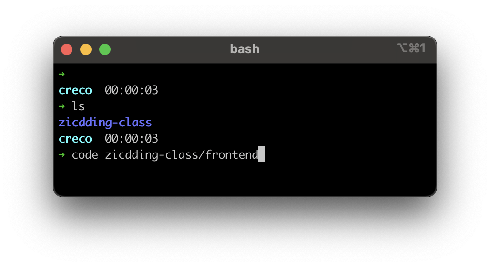
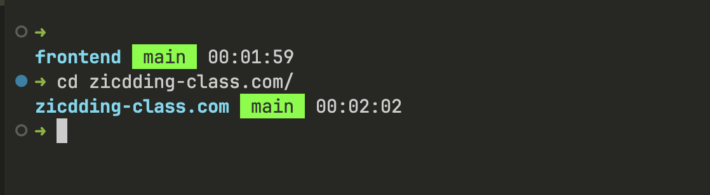
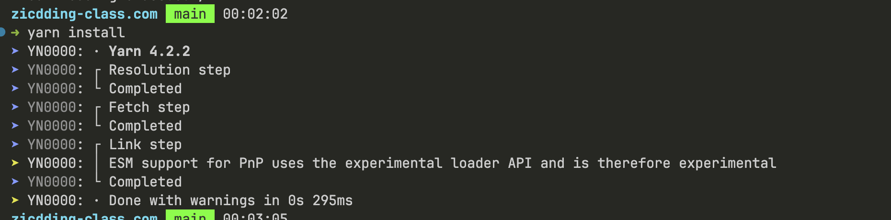
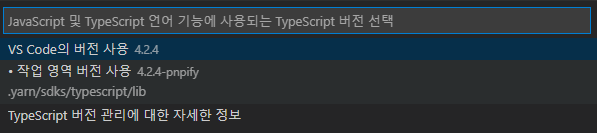
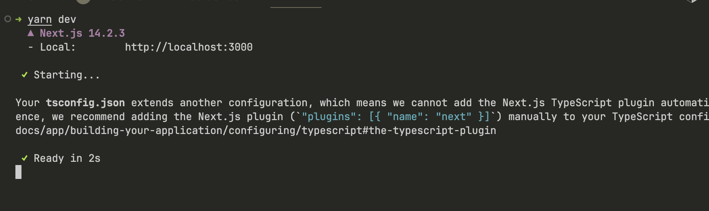
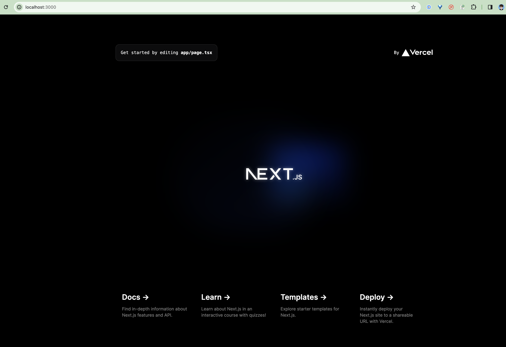

# zicdding-class-frontend

직띵 클래스 웹 프로젝트 프론트엔드

## 시작하기

### 0. vscode 를 frontend 위치로 열어야합니다.

- yarn berry 로 typescript resolve 를 하기 위해 반드시 frontend 를 기준으로 열어야합니다.

```
code ./frontend
```



### 1. 터미널을 열고 zicdding-class.com (가칭) 으로 이동합니다.

```
cd ./zicdding-class.com
```



### 2. yarn install

```
yarn install
```



🔴 `Cannot find module '' or its corresponding type`에러 발생시 해결방법.

1. `Shift` + `Cmd`/`Ctrl` + `P` 누르고 `TypeScript: Select TypeScript Version` 선택합니다.

2. `VS Code의 버전 사용`을 선택하지말고 `Use Workspace Version`을 선택합니다.
   

3. 해결되지 않으면 VSCode 재시작합

### 3. yarn dev

```
yarn dev
```



### 4. 브라우저에서 확인하기


